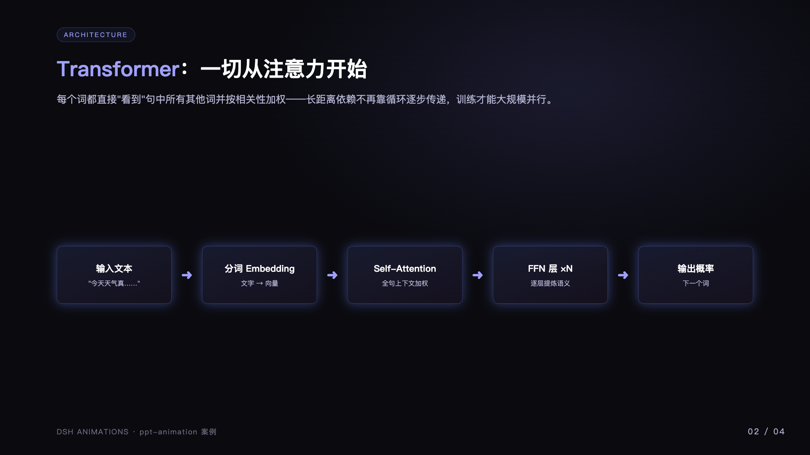
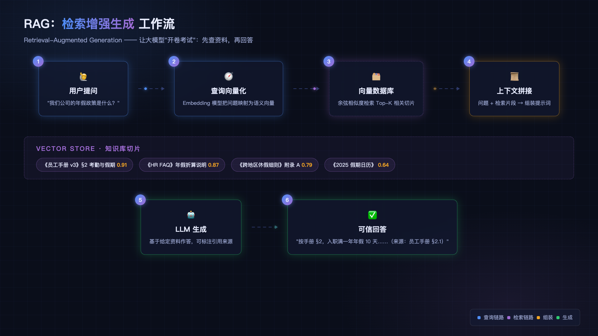
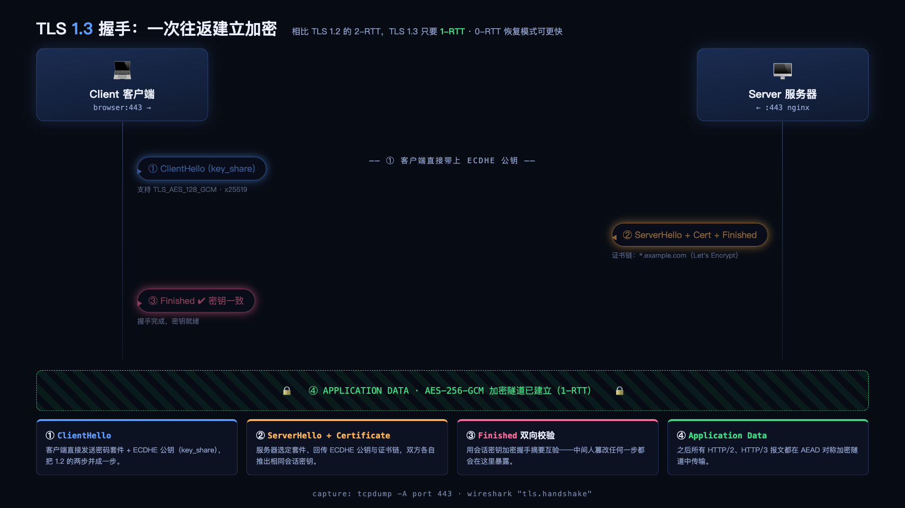
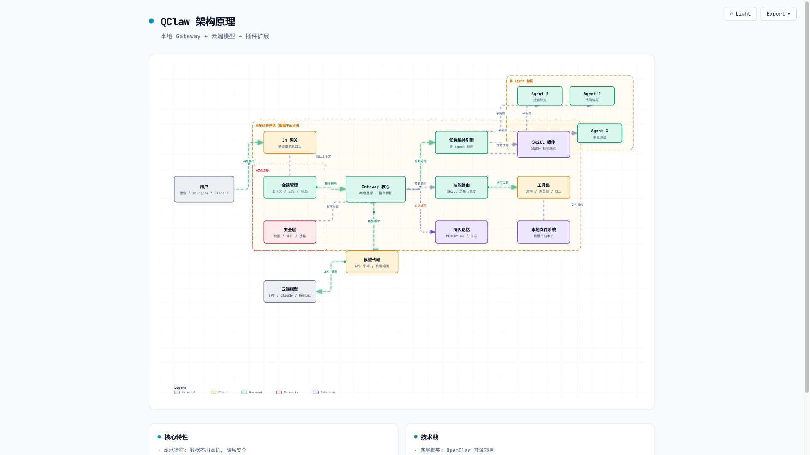
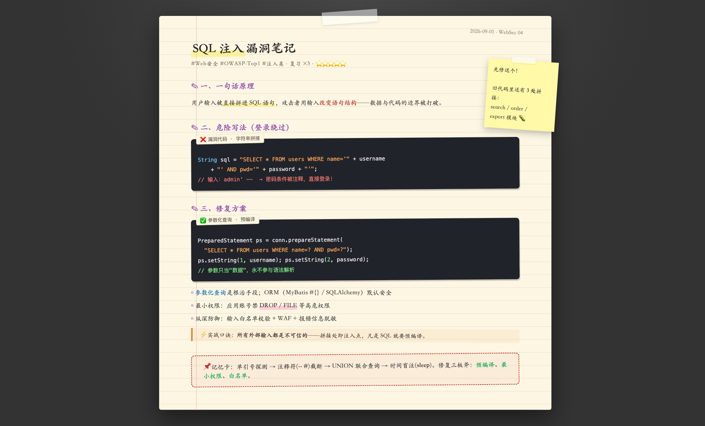
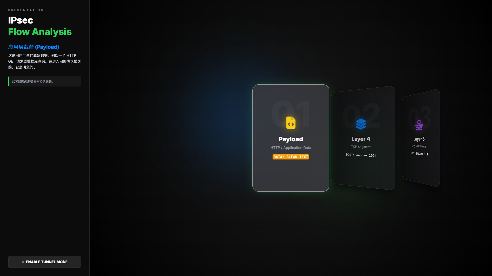
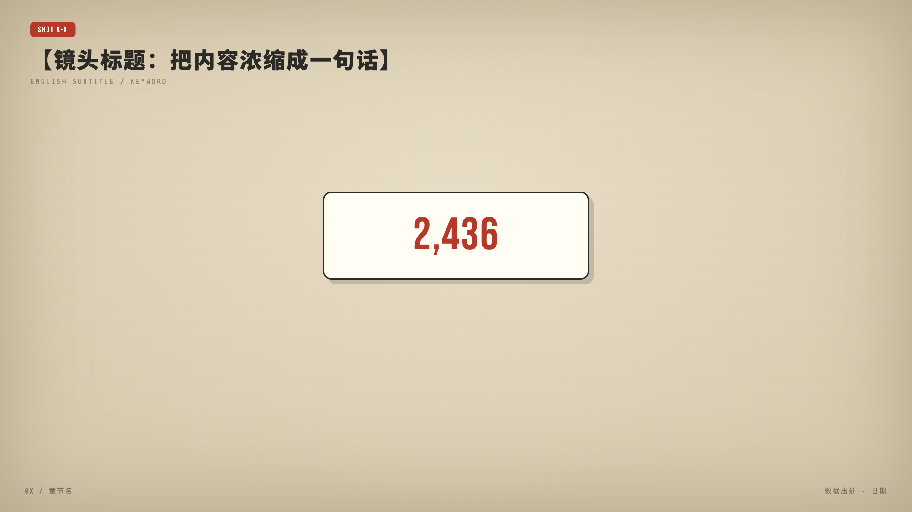
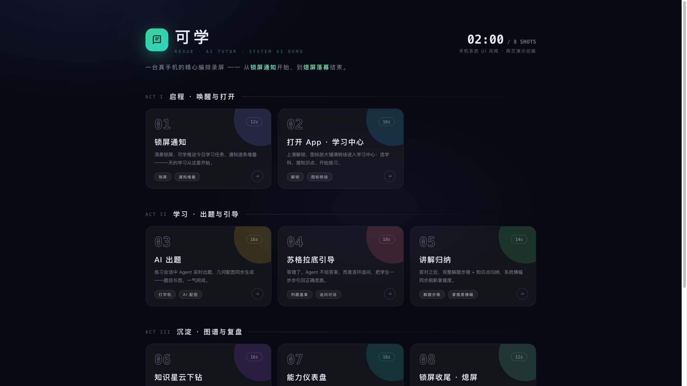

# dsh-animations

**DSH 原生动效技能包 · 8 个 HTML 动画技能一次装齐**

*一套用 AI 生成炫酷单文件 HTML 动画的技能集合：装进 DSH 就是标准插件，放进 Claude Code / Cursor 就是通用 Agent Skills*

🌐 **English version**: [`README_EN.md`](README_EN.md)

---

### 这是什么

本仓是 **8 个动效 Skill 的集合**，每个 Skill 是一个自包含文件夹：`SKILL.md`（Agent 执行指令）+ `README.md`（人类文档）+ `references/`（Prompt 参考）+ `assets/`（模板 HTML）。所有产物都是**单文件 HTML**——双击浏览器直接打开，全屏录屏即成片。

它有双重身份：

| 形态 | 谁在用 | 怎么装 |
|---|---|---|
| 🧩 **DSH 标准插件** | DSH / KCoder 用户 | [`dsh plugin add`](#安装)，激活即注册 8 个 runtime skill + 「动画演示专家」Agent 预设 |
| 🎯 **通用 Agent Skills** | Claude Code / Cursor / Codex CLI / WorkBuddy | [`npx skills add`](#安装) 或手动复制 `skills/<name>/` |

**技能矩阵**：

| Skill | 形态 | 适用场景 |
|---|---|---|
| `ppt-animation` | PPT 风格翻页演示 | 视频科普、技术讲解、直播课件 |
| `flowchart` | 教育流程图 / 概念图 | 原理演示、AI 模型可视化、PPT 配图 |
| `network-protocol-viz` | 网络协议动态演示 | TCP / 以太帧 / IPv4 / 路由 / DHCP / HTTPS |
| `dynamic-archify` | 工程架构图 / 时序图 | 架构可视化、Mermaid 美化、多格式导出 |
| `scholar-notes` | 手写笔记本风格笔记 | 学习笔记、漏洞分析、知识总结 |
| `card-theater` | 侧边栏叙事 + 3D 卡片轮播 | 协议流程、产品特性、分步讲解 |
| `video-shot-demos` | 电影级视频分镜（一镜头一 HTML） | 视频配套演示、录屏成片 |
| `phone-ui-demos` | 手机系统 UI 编排录屏 | 产品演示、锁屏通知 / 聊天 / 设置页镜头 |

---

### 🖼️ 案例示例展示

以下 8 张示例图全部由对应 Skill **重新生成**（4 个为新创作的案例页，4 个截自技能自带模板/成片），均为本仓内文件——clone 后用浏览器打开对应 HTML 即可复现动态效果。

#### 1. `ppt-animation` · 大语言模型是怎么工作的

新创作案例 [`docs/examples/llm-work-ppt-demo.html`](docs/examples/llm-work-ppt-demo.html)：4 页翻页演示（dark-tech 主题），翻页后元素依次缓入——Transformer 架构流程、下一词预测概率条、训练三阶段卡片。支持 `#slide=N` 直达与键盘/点击翻页。

#### 2. `flowchart` · RAG 检索增强生成工作流

新创作案例 [`docs/examples/rag-flowchart-demo.html`](docs/examples/rag-flowchart-demo.html)：暗色科技风 + 发光节点 + 流动箭头 + 数据粒子，向量库切片按相似度排序展示——「让大模型开卷考试」的完整链路。

#### 3. `network-protocol-viz` · TLS 1.3 握手

新创作案例 [`docs/examples/tls13-handshake-demo.html`](docs/examples/tls13-handshake-demo.html)：客户端/服务器双泳道时序 + 报文胶囊往返飞行 + 加密隧道落成横幅 + 四步看板，一图讲清「1-RTT 建立加密」。

#### 4. `dynamic-archify` · QClaw 架构原理

案例 [`docs/examples/qclaw-architecture-demo.html`](docs/examples/qclaw-architecture-demo.html)：由架构 JSON 经渲染器生成的工程级架构图——安全边界 / Agent 协同分组、流动连线、内置明暗主题切换与一键导出 PNG/WebM。

#### 5. `scholar-notes` · SQL 注入漏洞笔记

新创作案例 [`docs/examples/sql-injection-note-demo.html`](docs/examples/sql-injection-note-demo.html)：手写笔记本风格——横线纸 + 胶带 + 便利贴 + 荧光笔高亮 + 黑白打印风代码卡，「危险写法 → 参数化修复 → 记忆口诀」一页读完。

#### 6. `card-theater` · IPsec Flow Analysis

截自技能模板 [`skills/card-theater/assets/coverflow-classic.html`](skills/card-theater/assets/coverflow-classic.html)：左侧叙事栏 + 右侧 Coverflow 3D 卡片轮播，支持模式切换（传输/隧道）、Focus 展开、荧光笔高亮。

#### 7. `video-shot-demos` · 电影化播放器骨架

截自技能骨架 [`skills/video-shot-demos/assets/template.html`](skills/video-shot-demos/assets/template.html)：统一电影化播放器机制——镜头标记 + 数字滚动卡 + 关键词高亮字幕条 + WebAudio 合成音效，点击「启动播放」后全屏录屏即成片。

#### 8. `phone-ui-demos` · 可学 AI Tutor 分镜表

截自成片实例 [`skills/phone-ui-demos/assets/examples/kexue/index.html`](skills/phone-ui-demos/assets/examples/kexue/index.html)：三幕 8 镜头编排（启程 / 学习 / 沉淀），从锁屏通知到熄屏落幕——一台「真手机」的精心编排录屏。

---

### Skills 一览

#### `ppt-animation` — PPT 演示 / 翻页动画

**适用于：** 视频录制、技术科普、教学演示——需要「PPT 翻页 + 元素依次缓入」的场景。

- 16:9 宽高比，适配全屏播放与录屏
- 每次翻页后元素依次缓入出现（细化到每行文字）
- 5 套内置主题：`dark-tech` / `warm-paper` / `clean-white` / `cyber-red` / `gradient-dark`
- 支持以已有模板为基础重构（「以 assets/xxx.html 为模板演示以上内容」）

Links: [README](./skills/ppt-animation/README.md) · [SKILL.md](./skills/ppt-animation/SKILL.md) · [案例](docs/examples/llm-work-ppt-demo.html)

#### `flowchart` — 教育流程图 / 概念图 / 原理演示

**适用于：** 视频科普、技术讲解、PPT 配图——动画流程图、概念对比、原理演示。

- 7 种图表类型：流程图 / 概念图 / 原理演示 / 时序图 / 对比图 / 时间线 / 系统概览
- 内置 AI/ML 模型可视化：RNN / LSTM / GRU / MLP / Word2Vec / GPU
- 暗色科技风：发光节点 + 渐变连线 + 数据粒子
- 自动播放 / 手动步进 / hover 高亮三种交互模式

Links: [README](./skills/flowchart/README.md) · [SKILL.md](./skills/flowchart/SKILL.md) · [案例](docs/examples/rag-flowchart-demo.html)

#### `network-protocol-viz` — 网络协议可视化

**适用于：** 网络课程、协议讲解、抓包分析演示。

- 覆盖 TCP 握手、以太网帧、IPv4 数据报、路由表、交换机 MAC 表、DHCP、HTTPS
- 数据包流动动画 + 逐层拆解视角 + 抓包观感
- 8 套成品模板随技能分发（`assets/`）

Links: [README](./skills/network-protocol-viz/README.md) · [SKILL.md](./skills/network-protocol-viz/SKILL.md) · [案例](docs/examples/tls13-handshake-demo.html)

#### `dynamic-archify` — 动态架构图（工程级）

**适用于：** 系统架构 / 基础设施 / 云架构 / 审批流 / CI/CD / 时序 / 数据管道 / 状态机，或 Mermaid 图美化。

- 自然语言或 Mermaid 输入，从零布局
- SVG 图形 + 流动动画，内置明暗主题切换
- 一键导出 PNG / JPEG / WebP / SVG / GIF / WebM
- JSON Schema 驱动，含 5 种图表渲染器与示例集

Links: [README](./skills/dynamic-archify/README.md) · [SKILL.md](./skills/dynamic-archify/SKILL.md) · [案例](docs/examples/qclaw-architecture-demo.html)

#### `scholar-notes` — 学霸笔记（手写笔记本风格）

**适用于：** 把技术内容、漏洞分析、知识总结转化为视觉精美的网页笔记。

- 两种模板风格：经典手账 / 学术期刊
- 荧光笔、便利贴、胶带、手绘图示等组件库
- 布局库 + 组件手册 + 交付 checklist 齐备

Links: [README](./skills/scholar-notes/README.md) · [SKILL.md](./skills/scholar-notes/SKILL.md) · [案例](docs/examples/sql-injection-note-demo.html)

#### `card-theater` — 卡片剧场（侧边栏叙事 + 3D 卡片轮播）

**适用于：** 协议流程演示、产品特性展示、分步讲解的叙事感演示。

- 滚动翻页 / Coverflow 3D / Focus 展开等多种交互模式
- 模式切换（如传输/隧道）、荧光笔高亮、水印图标
- 7 套成品模板随技能分发（`assets/`）

Links: [README](./skills/card-theater/README.md) · [SKILL.md](./skills/card-theater/SKILL.md) · [模板](skills/card-theater/assets/coverflow-classic.html)

#### `video-shot-demos` — 视频分镜演示（一个镜头一个 HTML）

**适用于：** 给视频做演示动画网页、把口播稿/大纲做成动画、录屏成片。

- 统一电影化播放器机制：时间轴、镜头切换、字幕条、进度 HUD
- 29 种视觉风格轮换 + 镜头推拉 + WebAudio 合成音效（零音频文件）
- 角色表情吐槽系统（表情素材库随技能分发）
- 附两套完整成片实例（GLM 29 镜头 / Doubao 11 镜头）与无头截图质检脚本

Links: [README](./skills/video-shot-demos/README.md) · [SKILL.md](./skills/video-shot-demos/SKILL.md) · [模板](skills/video-shot-demos/assets/template.html)

#### `phone-ui-demos` — 手机系统 UI 演示（编排录屏）

**适用于：** 把产品/知识点做成「真手机录屏」：锁屏通知、聊天、设置页、App 界面逐镜头呈现。

- HyperOS/MIUI 级手感动效 + 虚拟时钟播放器
- 分镜表确认工作流 + 四份规范（播放器/手机舞台/大字幕/系统组件）
- 附 kexue 8 镜头成片实例

Links: [README](./skills/phone-ui-demos/README.md) · [SKILL.md](./skills/phone-ui-demos/SKILL.md) · [成片](skills/phone-ui-demos/assets/examples/kexue/index.html)

---

### 安装

#### 方式一 · DSH 插件（推荐）

`sh`
# 从 dsh-plugins 镜像仓安装（子目录插件用路径安装）
git clone git@github.com:kkutysllb/dsh-plugins.git
dsh plugin --profile web add ./dsh-plugins/dsh-animations

# 或从独立仓直接安装
dsh plugin --profile web add ./dsh-animations
`

安装后重启 DSH 生效，你将获得：

- **8 个 runtime skill**：会话中直接说「用 card-theater 演示……」即可触发（项目级同名技能可覆盖）；
- **能力通告**：system prompt 自动注入一段能力矩阵说明，Agent 知道何时路由到哪个技能；
- **「动画演示专家」Agent 预设**：Web GUI 可一键切换的专职动效交付 Agent（自动安装到 `~/.dsh/.agent-presets/dsh-animations/`）。

配置开关（cordis.yml patch 可调）：`enabled`（默认 true）、`announceToAgent`（默认 true）。

#### 方式二 · `skills` CLI（任意 Agent）

`bash`
# 安装全部 Skill
npx skills add https://github.com/kkutysllb/dsh-animations

# 安装单个 Skill
npx skills add https://github.com/kkutysllb/dsh-animations/tree/main/skills/ppt-animation
`

#### 方式三 · Git Clone

`bash`
git clone https://github.com/kkutysllb/dsh-animations.git
# 将 skills/<skill-name>/ 复制到你的 Agent 技能目录
`

### 快速上手

安装后在 AI Agent 里直接说：

`
用 ppt-animation 制作一个关于"HTTP协议"的演示，暗色主题，5页
用 flowchart 演示 LSTM 的工作原理
用 network-protocol-viz 可视化 TLS 1.3 握手
用 dynamic-archify 画一个微服务架构图，带流动动画，导出 PNG
把以上内容做成学霸笔记，Style A 风格
用 card-theater 演示 IPsec 数据流转过程，需要模式切换
用 video-shot-demos 把这期视频的口播稿做成分镜演示动画，每个镜头一个 HTML
用 phone-ui-demos 把这个 App 的功能做成手机录屏风格的演示动画，先出分镜表我确认
`

---

### 插件形态（面向 DSH 用户与开发者）

本仓按 DSH 标准 bundle 规范发布（对齐 `dsh-skills-bundle` 的零构建胶水形态 + `dsh-super-ppts` 的通告/预设模式）：

`text`
dsh-animations/
├── package.json            ← dsh bundle manifest（files 白名单 / scripts / dsh.bundle.patch）
├── cordis.patch.yml        ← bundle 层注册（id: dsh-animations）
├── entry.js                ← 胶水插件（零依赖 ESM）：注册 skills + 通告 + 预设
├── skills/
│   ├── manifest.json       ← 技能注册清单（单一事实源，smoke 对账）
│   ├── <skill>/SKILL.md    ← 技能正文（frontmatter 剥离后注册）
│   └── <skill>/assets/     ← 模板资产（resourceBase 指向技能目录）
├── presets/                ← 「动画演示专家」Agent 预设（preset.yml + agent.cordis.yml）
├── docs/
│   ├── examples/           ← 案例示例 HTML（本页展示图的可复现源）
│   └── screenshots/        ← 案例示例图
├── scripts/
│   ├── smoke-plugin.mjs    ← 冒烟：清单对账 + apply 全流程 + 通告覆盖
│   └── sync-to-dsh-plugins.mjs  ← 真源 → dsh-plugins 镜像同步（--check 对账）
├── web_animation/          ← 历史成品画廊（源仓展示物，不随插件分发）
└── README.md
`

**运行机制**：`cordis.patch.yml` 被 DSH 主进程物化进 profile → 激活 `entry.js` → 读取 `skills/manifest.json` 逐个 `ctx.skills.register()`（`resourceBase` 指向技能目录，正文引用的相对资产可解析）→ 向 systemPrompt 注入能力通告 section → 拷贝 Agent 预设到用户目录。

**开发与发版**：

`sh`
npm run smoke          # 插件冒烟（清单一致性 + apply 全流程 + 通告覆盖）
npm run sync:mirror    # 镜像到 ../dsh-plugins/dsh-animations/（发版前置）
npm run sync:check     # 对账断言：镜像与真源零差异
`

三级分发链：**本仓（真源）→ [dsh-plugins](https://github.com/kkutysllb/dsh-plugins)（镜像收纳）→ KCoder `bundle/`（随包分发）**。改插件先改本仓，commit 后跑 `sync:mirror` 并在镜像仓提交推送。

### 兼容性

| Agent / Runtime | 安装形态 | 状态 |
|---|---|---|
| **DSH / KCoder** | DSH 插件（runtime skill 注册） | ✅ 原生 |
| **WorkBuddy** | `~/.workbuddy/skills/<name>/` | ✅ 已测试 |
| **Claude Code** | `.claude/skills/<name>/` | ✅ 兼容 |
| **Cursor** | `.agents/skills/<name>/` | ✅ 兼容 |
| **Codex CLI** | `.codex/skills/<name>/` | ✅ 兼容 |
| **Gemini CLI** | extension manifest | ✅ 兼容 |

> `SKILL.md` 格式与 Agent 无关：只要 Agent 支持 Skills 规范，把 `skills/<name>/` 复制到对应目录即可。

### 贡献与许可

欢迎提交新的动画 Skill！新技能三步：

1. 复制 [`skills/SKILL_TEMPLATE.md`](skills/SKILL_TEMPLATE.md) 起步，补全 `SKILL.md` / `README.md` / `references/` / `assets/`；
2. 在 [`skills/manifest.json`](skills/manifest.json) 登记（name / dir / description / whenToUse）；
3. 跑 `npm run smoke`（清单对账会拦住漏登记的技能）。

详见 [CONTRIBUTING.md](./CONTRIBUTING.md)。MIT License。
